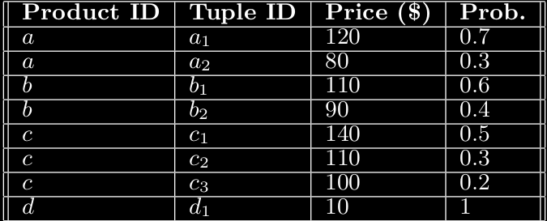

# Uncertain Data Management Systems: Paper Summaries

## Paper 1: 
_Cheng, Reynold, Jinchuan Chen, and Xike Xie. "Cleaning uncertain data with quality guarantees." Proceedings of the VLDB Endowment 1.1 (2008): 722-735._

Link To Paper: [Link](http://www.vldb.org/pvldb/vol1/1453935.pdf)

---

# Problem Statement

---

# Related

---

## Probabilistic Database Model: Notation

- Probabilistic database $D$
- Number of entities of x-tuples: $m$, $k$th x-tuple: $\tau_k$
- x-tuples are independent of each other
- Each x-tuples = $\{t_i\}$ representing a distribution of values within x-tuple
- Number of tuples: $n$

---

- $t_i = (ID_i, v_i, e_i, x_i)$
    - $ID_i$ - unique identifier of $t_i$
    - $v_i$ - real world attribute called _querying attribute_(can be multidimensional)
    - _existential probability of $t_i$_ - probability that $t_i$ exists in the real world
    - $x_i \in \{k|k=1,...,m\}$ - indicating which x-tuple $t_i$ belongs to  

---

- Within the same x-tuple
    - Existence is mutually exclusive
    - $\sum_{t_i \in x_k} e_i = 1$ (null tuples are added if this sum is less than 1) 

---

# Proposed Solution

---

# Results

---

# Future Problems

---

# Thoughts

---