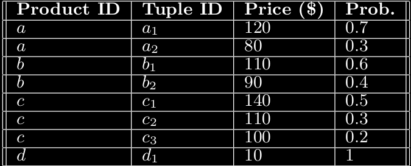
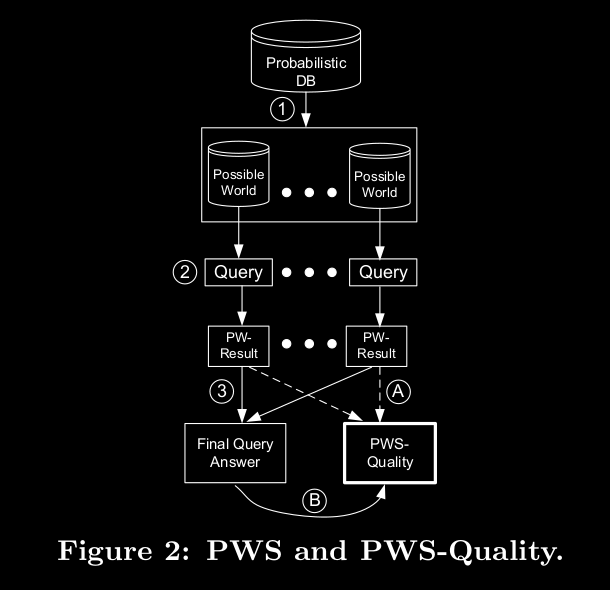

# Uncertain Data Management Systems: Paper Summaries

_Cheng, Reynold, Jinchuan Chen, and Xike Xie. "Cleaning uncertain data with quality guarantees." Proceedings of the VLDB Endowment 1.1 (2008): 722-735._

Link To Paper: [Link](http://www.vldb.org/pvldb/vol1/1453935.pdf)

---

# Problem Statement


---

# Related

---

## Probabilistic Database Model: Notation

- Probabilistic database $D$
- Number of entities of x-tuples: $m$, $k$th x-tuple: $\tau_k$
- x-tuples are independent of each other
- Each x-tuples = $\{t_i\}$ representing a distribution of values within x-tuple
- Number of tuples: $n$

---

- $t_i = (ID_i, v_i, e_i, x_i)$
    - $ID_i$ - unique identifier of $t_i$
    - $v_i$ - real world attribute called _querying attribute_(can be multidimensional)
    - _existential probability of $t_i$_ - probability that $t_i$ exists in the real world
    - $x_i \in \{k|k=1,...,m\}$ - indicating which x-tuple $t_i$ belongs to  

---

- Within the same x-tuple
    - Existence is mutually exclusive
    - $\sum_{t_i \in x_k} e_i = 1$ (null tuples are added if this sum is less than 1) 


---

### Example


- Entities / x-tuples  = $\{a(a_1, a_2), b(b_1, b_2), c(c_1, c_2, c_3), d(d_1)\}$
- $v_i$ = Price
- $e_i$ = Prob.


---

## Queries

### Non-rank-based Queries

> Qualification probability is independent of other tuples

Ex: Range Queries

| Probabilistic Range Query (PRQ) |
|---|
|Given a closed interval $[a, b]$ where $a, b \in \mathcal{R}$ and $a \leq b$ a PRQ returns a set of tuples $(t_i, p_i)$ where $p_i$ the qualification probability of $t_i$ is the non-zero probability that $v_i \in [a, b]$|

---

Computing PRQ

```python
for i:1-n:
    if vi in [a, b]:
        pi = ei
    else:
        pi = 0
```

---

### Rank-based Queries

> Qualification probability is dependent of other tuples

Ex: MAX MIN queries

|Probabilistic Maximum Query (PMaxQ)|
|---|
| A PMaxQ returns a set of tuples $(t_i, p_i)$, where $p_i$ the qualification probability of $t_i$, is the non-zero probability that $v_i \geq v_j$ where $j \ne i \wedge j = 1, ..., n$ |

---

Computing PMaxQ

```python
for i:1-n:
    pi = ei x probability that x_j (j not = i) don't have tuple with vj > vi
```

---

## PWS Quality




1: Expanded to set of _possible worlds_
2: Query executed on each world
called _PW-results_
3: PW-results combined

Can be applied to any query type

---

## PWS Quality
<!--Left hand side -->

<!--Right hand side -->


For example,

$W_1 = \{a_1, b_2, c_3, d_1\}$

Max(price, $W_1$) = $a_1$ with
prob = $0.7 \times 0.4 \times 0.2 \times 1 = 0.056$

Qualification Probability($a_1$) = 
sum of all probabilities where $a_1$ 
is the answer


---

## PWS Quality
<!--Left hand side -->

<!--Right hand side -->


PWS Quality is computed for using
all PW-results. (Step A)

Problem: There could be infinite 
PW-results

Paper proposes a method to compute
PWS Quality from the final query
answer (Step B) 

---

### PWS Quality Evaluation

> PWS Quality is entropy of PW-results

- set of $d$ distinct PW results: $\{r_1, ..., r_d\}$

- Probability $r_j$ is actual answer (_result probability of $r_j$): $q_j$ 

| PWS-quality |
|---|
| The PWS-quality of a query $Q$ evaluated on a database $D$ denoted by $S(D, Q)$ is $\sum_{j = 1}^{d}q_j \log_2 q_j$

---

- You can see that the PWS-quality is the negative of entropy

- Ranges from $-\log d$ (most ambiguous) to $0$ (least ambiguous)

- It is also important to note that

$$
\sum_{j = 1}^{d} q_j = 1
$$

i.e. sum of PW-result probabilities is $1$

---

## x-form of PWS Quality

> An x-form is essentially a sum of some function $g$ evaluated on each x-tuple $\tau_k$, and $g$ can be computed efficiently based on the probability information of the tuples in $\tau_k$

Let

- $Y(x) = x\log x$
- Qualification Probability of $\tau_k = P_k = \sum_{t_i \in \tau_k} p_i$

---

Lemma 1. The x-form of PWS-Quality is given by:

$$
S(D, Q) = \sum_{k=1}^m g(k, D, Q)
$$

For **PRQ**

$$
g(k, D, Q) =  \sum_{t_i \in \tau_k} p_i \log e_i + Y(1 - P_k)
$$

---

For **PMaxQ**, let ith tuple of $\tau_k$ be $t_{k, i}$ sorted in descending order of $v_{k,i}$. If $t_{k, i}$ has existential probability $e_{k,i}$ and qualification probability $p_{k, i}$, then,

$$
g(k, D, Q) = \sum_{i = 1}^{|\tau_k|} \left (p_{k,i} \log e_{k, i} + \omega_{k,i} \log \left (1 - \sum_{j=1}^i e_{k,j} \right ) \right )
$$

where

$$
\omega_{k,i} = \begin{cases}
 \left (1 - \sum_{j=1}^i e_{k,j} \right ) \left ( \frac{p_{k,i}}{e_{k,i}} - \frac{p_{k,i+1}}{e_{k,i+1}} \right ) &i < |\tau_k| \\
0 &i = |\tau_k|
\end{cases}
$$

---

Lemma 2. $g(k, D, Q) < 0$ iff there exists $t_i \in \tau_k$ such that $p_i \in (0, 1)$. Otherwise $g(k, D, Q) = 0$ 

- An x-tuples whose tuples' qualification probabilities are either 0 or 1 _does not need to be included in PWS Quality computation_. This is also the set of x-tuples whose 

---

## Derivation of x-form PWS Quality for PRQ

The probability $q_j$ of getting $r_j$ is

$$
q_j = \prod_{t_i \in r_j} e_i \prod_{\tau_k \cap r_j = \phi} (1 - P_k)
$$

- In words: the probability $q_j$ of getting possible world solution $r_j$ is the product of the existential probability of each tuple in $r_j$ and the probability of non-occurance of any of x-tuples that 
don't occur in $r_j$. 

---

- Note that we don't include x-tuples which have intersection but some tuples aren't in $r_j$ because in any possible world only one tuple can exist in $r_j$ from any $x_k$

- Further, the qualification probability of $t_i$ denoted by $p_i$ can be derived from qualification probabilities of $r_j$s

$$
p_i = \sum_{j = 1 \wedge t_i \in r_j}^{d} q_i
$$

---

## How does such a derivation help

- There are atmost $m$ tuples in the final answer. 

- There are exponential $q_i$s 

- Therefore, an equation using the $p_i$s is easier to compute than an equation consisting of $q_i$s

---

## Deriving x-form for PMaxQ

- All tuples in an x-tuple are sorted in descending order
- $i$th tuples of $\tau_{k}$ = $t_{k,i}$
- A distinct PW-result $r_j$ consists of tuples with same value denoted by $r_j.v$. Then, 

$$
q_j = \prod_{t_i \in r_j} e_i \prod_{\tau_k \cap r_j = \phi} Pr(\tau_k < r_j.v)
$$

where, $Pr(\tau_k < r_j.v)$ is the probability that $\tau_k$ has tuples with value less than $r_j.v$

---

Since all tuples are written in descending order, 

$$
Pr(\tau_k < r_j.v) = 1 - \sum_{l=1}^{s(j,k)} e_{k,l}
$$

where,

$s(j,k)$ = integer in $[1, |\tau_k|]$ such that $v_{k,s(j,k)}$ is the smallest value greater than $r_j.v$

---

# Clearning Uncertain Data

> The goal is to select the most appropriate set of x-tuples to be cleaned, under a stringent budget, in order to achieve the highest expected quality improvement.


| $clean(\tau_k)$ |
| --- |
| Given an x-tuple $\tau_k$, $clean(\tau_k)$ replaces $\tau_k$ with an x-tuple that contains a single tuple: $\{ID_i, v_i, 1, k\}$ such that $ID_i$ and $v_i$ are the ID and querying attribute of some tuple $t_i$ that belongs to $\tau_k$|

After $clean(\tau_k)$, $\tau_k$ becomes certain

---

> The goal is to obtain the set of x-tuples that, under a given budget, yields the most significant expected improvement in PWS-quality. This set of x-tuples is then selected to be cleaned.

---

### Notation

- Cost of performing $clean(\tau_k)$: $c_k$

- Budget allotted to query $Q$: $C$

- Any set of x-tuples chosen from $D$, $X$: $\{\tau_1, ..., \tau_{|x|}\}$

- $\vec{t}$: vector of dimension $|X|$ where kth dimension is a tuple from the kth x-tuple in $X$

- $D'(\vec{t})$ is the database obtained post cleaning $X$ producing tuples in $\vec{t}$

---

For example, 

$X = \{\tau_1, \tau_2 \}$, and $\tau_1 = \{t_0, t_1\}$ and $\tau_2 = \{t_2, t_3\}$, then possible values of $\vec{t}$ are $(t_0, t_2)$, $(t_0, t_3)$, $(t_1, t_2)$ and $(t_1, t_3)$

---

Expected quality of cleaning set $X$ is

$$
E(S(D'(\vec{t}), Q)) = \sum_{\vec{t} \in \tau_1 \times ... \times \tau_{|X|}} \prod_{t_i \in \vec{t}} e_i.S(D'(\vec{t}), Q)
$$

| Quality Improvement |
|---|
The quality improvement of cleaning a set of x-tuples $X$ is $I(X, D, Q) = E(S(D'(\vec{t}), Q)) - S(D, Q)$ |

---

### Problem Definition

| The Data Cleaning Problem |
|---|
|Given a budget of $C$ units, choose a set of x-tuples $X$ from $D$ such that $I(X, D, Q)$ attains the highest value|

Brute Force: Take all possible possible sets $X$, compute $I(X, D, Q)$ and retain that $X$ which results in the highest improvement

**Problem 1**: Computing expected quality requires computations involving all possible combination of x-tuple tuples in $\vec{t}$

**Problem 2**: Consider all possible $X$ is exponential 

---

## To Solve Problem 1: 

Lemma 3. The quality improvement of cleaning a set of x-tuples $X$ is:

$$
I(X, D, Q) = -\sum_{k=1}^{|X|} g(k, D, Q)
$$

- $I(X, D, Q)$ is always non-negative since $g(k, D, Q)$ is always non-positive


---

## To Solve Problem 2: Finding Optimal set $B$

Lemma 4. For any x-tuple $\tau_k \in B$, $\tau_k$ must satisfy the condition: there exists a $t_i \in \tau_k$ such that $(t_i, p_i)$ appears in the final answer of $Q$ with $p_i \in (0,1)$

- $Z$ - number of x-tuples that satisfy Lemma 4


---

# Future Problems

---

# Thoughts

---

# Questions

- What are entity-based queries?
- What is entropy
- 

---

---